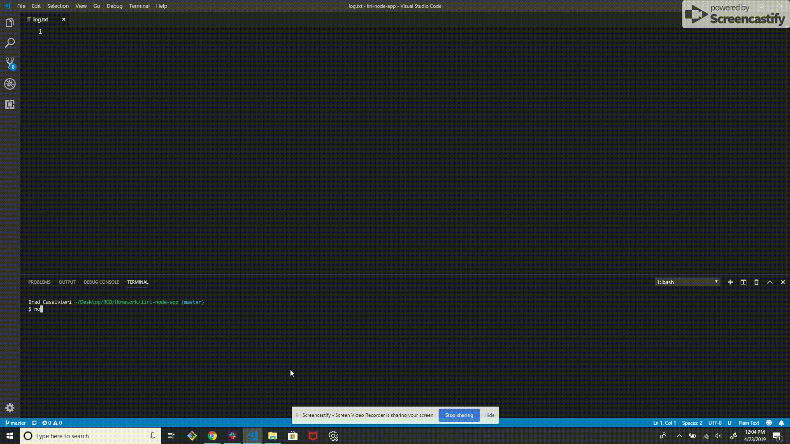
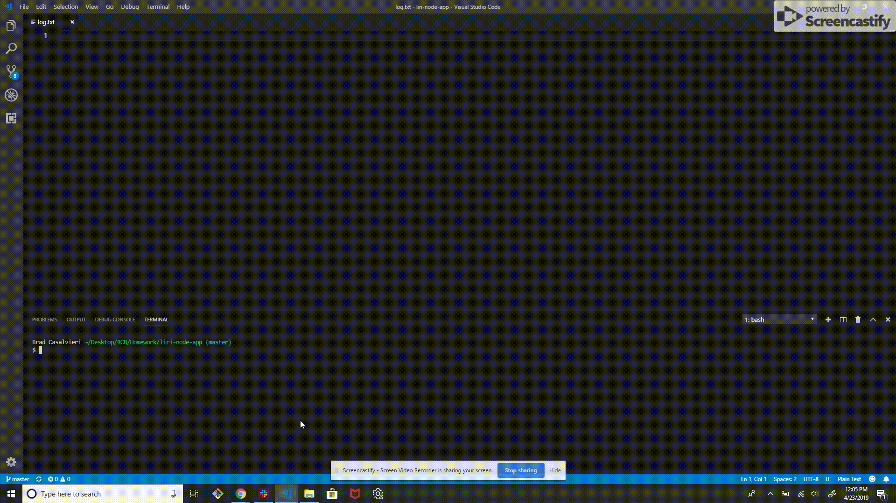

# LIRI Bot
Rutgers Coding Bootcamp LIRI Bot Homework

## Description
This app is LIRI, Language Interpretation and Recognition Interface, a command line node app that takes in commands (concert-this, spotify-this-song, and movie-this) and returns data to the user.

## Technologies Used
**Built with**
- Node.js
- Axios
- DotEnv
- Moment.js

**APIs used**
- OMDB API
- Bands in Town API
- Node-Spotify-API

## Features
When a user enters a search, the results are written both to the terminal and also appended to a log.txt file that the user can refer back to at a later time.

## How to use
Enter one of the 4 commands listed below followed by a band or artist name, song title, or movie title respectively.
1. **concert-this**: search for upcoming concerts for a band or artist

2. **spotify-this-song**: search for songs by song name

3. **movie-this**: search for movie information

4. **do-what-it-says**: follows command and input hidden in random.txt file

## License
MIT © Brad Casalvieri